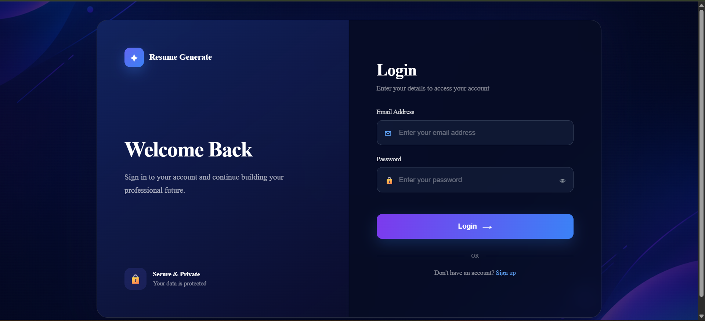
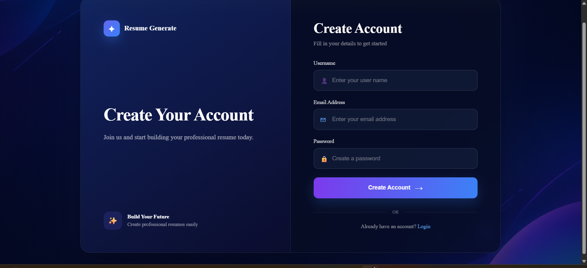
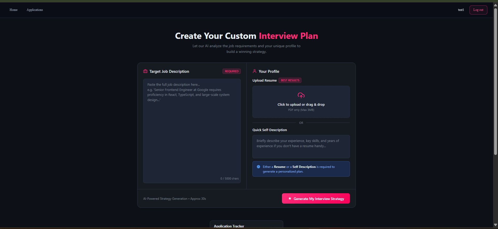
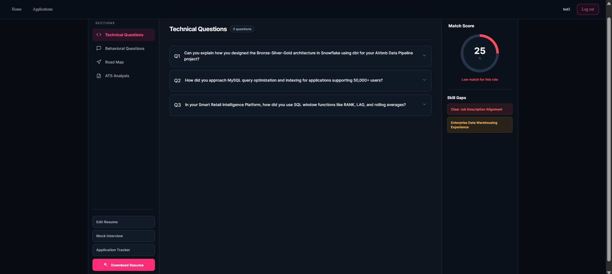
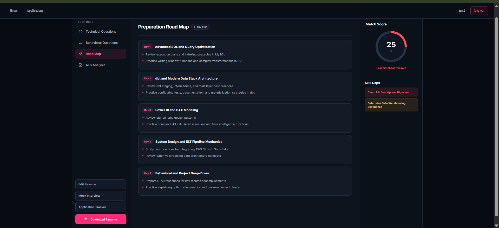
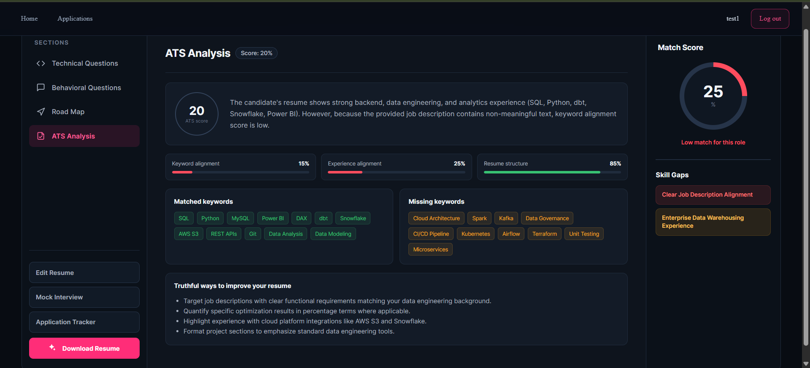
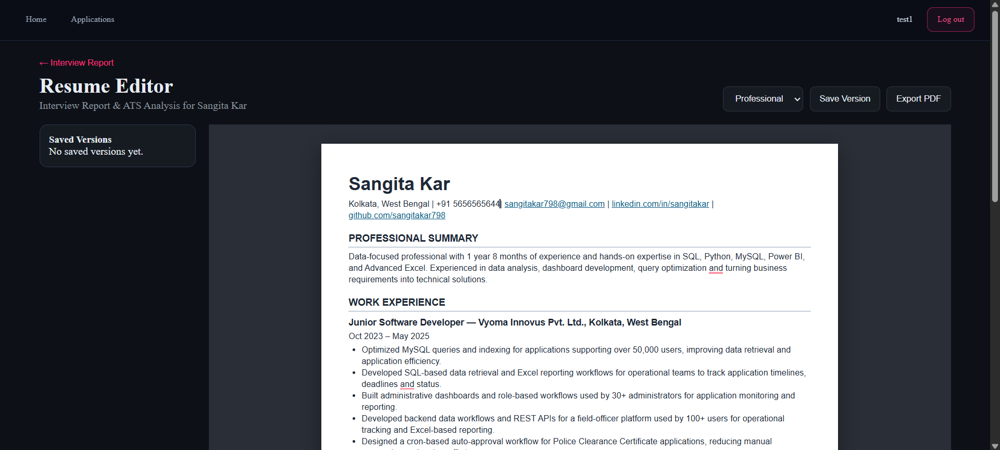
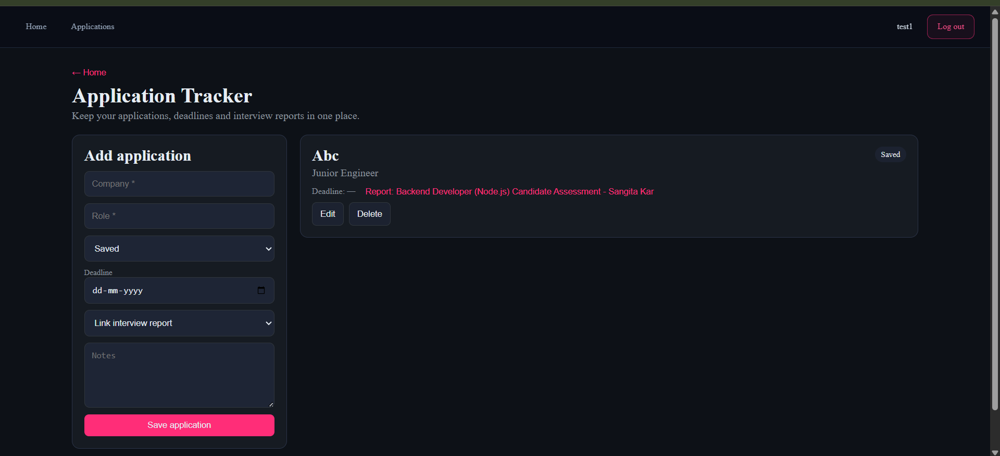

# AI Resume & Interview Preparation Platform

An AI-powered MERN application that helps users analyze their resume against a job description, generate personalized interview preparation plans, analyze ATS compatibility, generate optimized resumes, and track job applications.

## ✨ Features

- 🔐 User registration and login
- 🔑 Forgot password functionality
- 👁️ Show/hide password functionality
- 📄 Resume PDF upload
- 📝 Job description analysis
- 🤖 AI-powered interview preparation
- 💻 Technical interview questions
- 💬 Behavioral interview questions
- 🗺️ Personalized preparation roadmap
- 📊 Resume-to-job match score
- 📈 ATS analysis
- 🧩 Skill gap identification
- 📄 AI-generated resume
- ✏️ Resume editor
- 📥 Resume PDF export
- 📋 Application tracker

## 🛠️ Tech Stack

### Frontend

- React.js
- Vite
- Axios
- React Router
- SCSS

### Backend

- Node.js
- Express.js
- MongoDB
- Mongoose
- JWT
- bcrypt
- Multer
- Puppeteer

### AI

- Google Gemini API

## 📸 Screenshots

### Authentication

<p align="center">
  
  
</p>

### Interview Planning

<p align="center">
  
</p>

### Interview Report

<p align="center">
  
</p>

### Preparation Roadmap

<p align="center">
  
</p>

### ATS Analysis

<p align="center">
  
</p>

### Resume Editor

<p align="center">
  
</p>

### Application Tracker

<p align="center">
  
</p>
## 📂 Project Structure

```text
Resume_Generate/
│
├── Backend/
│   ├── src/
│   │   ├── config/
│   │   ├── controllers/
│   │   ├── middlewares/
│   │   ├── models/
│   │   ├── routes/
│   │   ├── services/
│   │   └── app.js
│   ├── server.js
│   └── package.json
│
├── Frontend/
│   ├── public/
│   ├── src/
│   │   ├── features/
│   │   │   ├── auth/
│   │   │   └── interview/
│   │   ├── App.jsx
│   │   ├── main.jsx
│   │   └── app.routes.jsx
│   └── package.json
│
├── screenshots/
└── README.md
```
## 👩‍💻 Author

### Sangita Kar

Software Developer | MERN Stack | Python | SQL

[GitHub](https://github.com/sangitakar798) ·
[LinkedIn](https://www.linkedin.com/in/sangitakar/) ·
Email: sangitakar798@gmail.com
